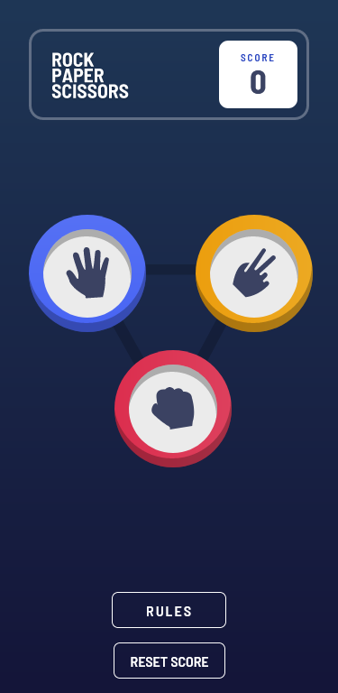
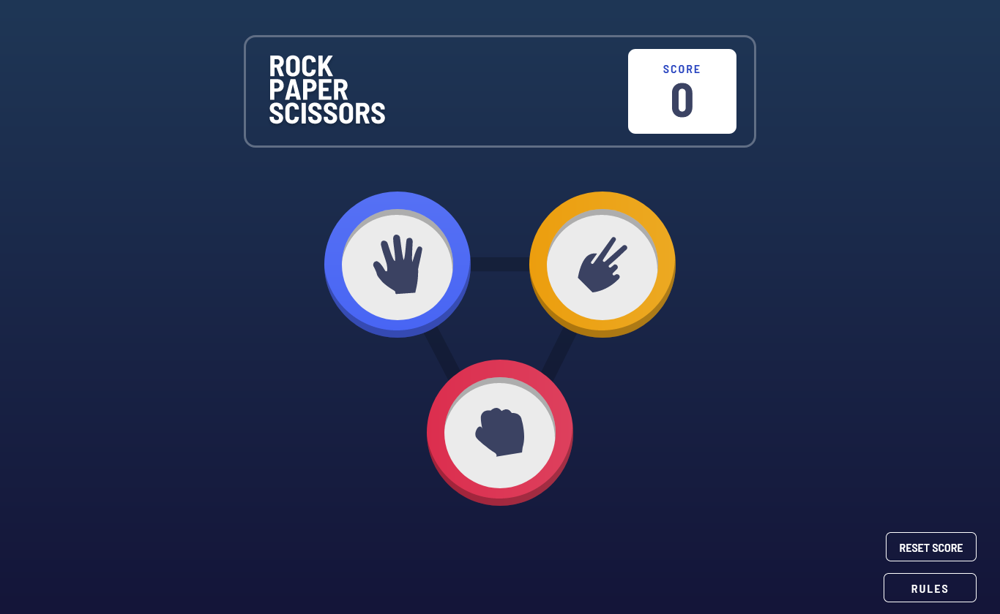

# Frontend Mentor - Rock, Paper, Scissors solution

This is a solution to the [Rock, Paper, Scissors challenge on Frontend Mentor](https://www.frontendmentor.io/challenges/rock-paper-scissors-game-pTgwgvgH). Frontend Mentor challenges help you improve your coding skills by building realistic projects.

## Table of contents

- [Overview](#overview)

  - [The challenge](#the-challenge)
  - [Screenshot](#screenshot)
  - [Links](#links)

- [My process](#my-process)
  - [Built with](#built-with)

## Overview

### The challenge

Users should be able to:

- View the optimal layout for the game depending on their device's screen size
- Play Rock, Paper, Scissors against the computer
- Maintain the state of the score after refreshing the browser _(optional)_
- **Bonus**: Play Rock, Paper, Scissors, Lizard, Spock against the computer _(optional)_

## Screenshot

### Mobile Solution (375px width)

### Desktop Solution (1440px width)

### Links

- [Solution URL](https://github.com/AchrefFast/Frontend-Mentor---Rock-Paper-Scissors)
- [Live Site URL](https://achreffast.github.io/Frontend-Mentor---Rock-Paper-Scissors)

## My process

### Built with

- Semantic HTML5 markup

- SASS

- CSS Grid
- CSS Flexbox

- Mobile-first workflow

- Javascript

- React

- Redux

- Redux-Toolkit

- Animation @keyframes

## Author

- Frontend Mentor - [@AchrefFast](https://www.frontendmentor.io/profile/AchrefFast)
- GitHub - [@AchrefFast](https://github.com/AchrefFast)
